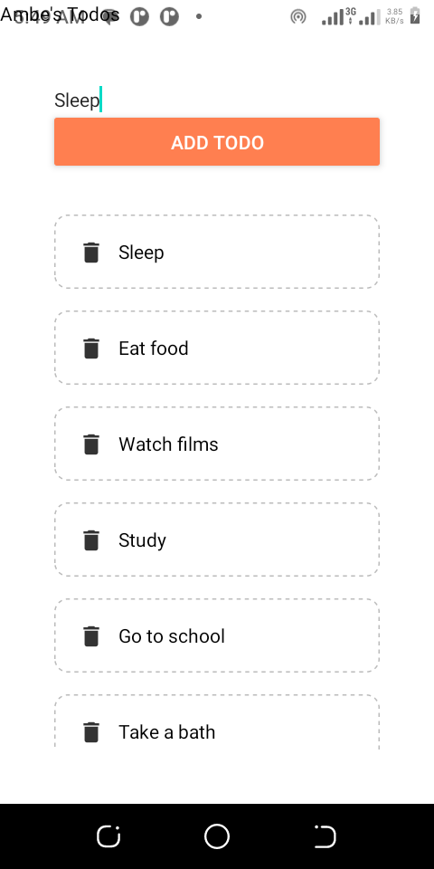
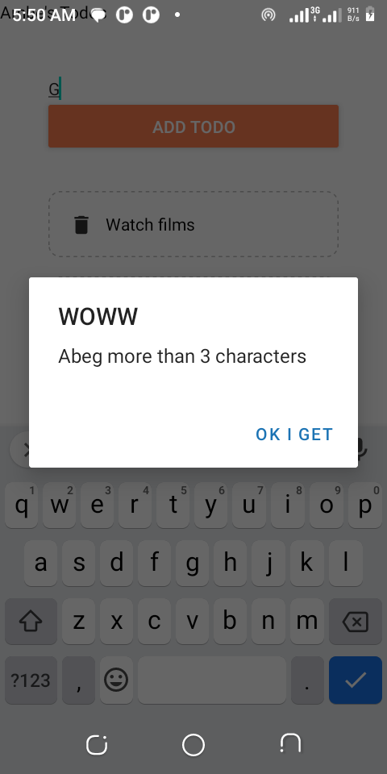
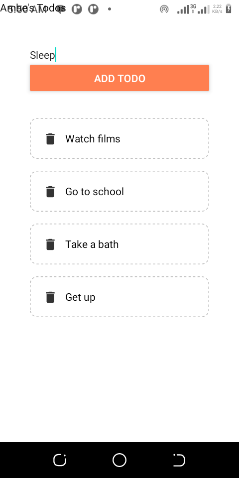

## Project Title: TODOLIST

## Table of contents

- [Description]  
- [Screenshots]
- [Built with]
- [What I learned]
- [Author]
- [Help]

## Description

- This is a Todo List. 
- The user is alloed to add as many todos as she wants to the list.
- To delete a todo, just click on it so it can be filtered from the todo array.

## Screenshots

- 
- 
- 

## Built with

- React Native

## What I learned

- How to create and reuse components
- How to use props which help us accept different parameters in different func components so we can reuse components.
- How to use states help us regulate which display we want.
- how to preview the app on my phone using expo

## Author

- Website - [Ambe Mbong-Nwi Nchang](https://github.com/Ambe-Mbong-Nwi/Front-end_Web_Designs)
- Frontend Mentor - [Ambe-Mbong-Nwi](https://www.frontendmentor.io/profile/Ambe-Mbong-Nwi)

## Help
- Net ninja
- google

